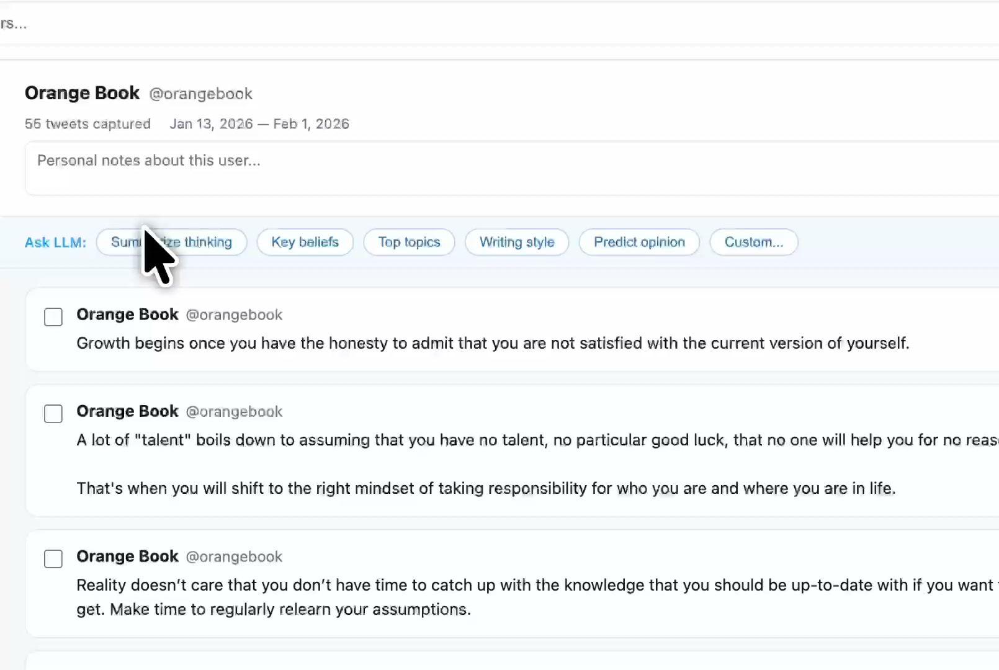

# X-Vault

Chrome extension that passively captures tweets as you browse Twitter/X. Store them locally, search across them, and export to LLMs.

[](demo.mp4)

## What it does

- Captures tweets from any profile
- Stores everything locally in your browser (IndexedDB)
- Fast search with inverted index
- One-click export with LLM prompt templates ("Summarize thinking", "Key beliefs", etc.)
- Star users you care about, block/delete the rest
- Bulk cleanup: remove anyone with N or fewer tweets
- Export/import your entire database

## Features

### Floating Button
A floating button appears on Twitter/X pages showing:
- The current profile's avatar
- Tweet count badge
- **Block button** — quickly block a user from being captured (also removes existing data)

### Capture Control
- **Profile pages** — always captured automatically
- **Individual tweets** — always captured when you open a specific tweet
- **Home feed** — disabled by default (toggle in popup settings)

### Visual Indicators
- ✓ Green checkmark on captured tweets (subtle, 50% opacity)
- "BLOCKED" badge on tweets from blocked users

## Install

1. Clone this repo
2. Open `chrome://extensions` in Chrome
3. Enable **Developer mode** (top right)
4. Click **Load unpacked** and select the repo folder

## Usage

1. Browse any Twitter/X profile — tweets are captured automatically
2. Click the extension icon to see a quick summary, or click **Dashboard** for the full UI
3. Use the sidebar to browse users, search bar to find tweets
4. Click any **Ask LLM** button to copy tweets + a prompt to your clipboard, then paste into Claude/ChatGPT
5. Toggle **Home** checkbox in popup to enable/disable home feed capture

## Performance

Built for scale — optimized for 50,000+ tweets:

- **Inverted index** for fast text search (no full-table scans)
- **O(1) blocked user checks** via dedicated store
- **Pre-sorted user list** using compound index
- **Incremental tweet counts** (no recounting)

## Files

```
manifest.json   - Chrome extension manifest (MV3)
content.js      - Scrapes tweets from Twitter/X pages
background.js   - Service worker handling storage
db.js           - IndexedDB operations (v5 schema)
dashboard.*     - Full-page dashboard UI
popup.*         - Extension popup UI
icons/          - Extension icons
```

## License

MIT
